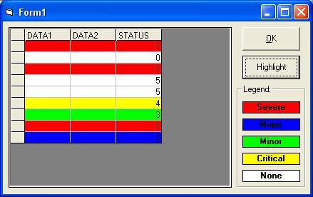



## MSFlexGrid Highlight

### Description

Shows how to highlight a row in the MSFlexGrid based on a Column name and Value given any color.
 
### More Info
 
MSFlexGrid, Column Name, Value, Color

HighlightGrid(FlexGrid as MSFlexGrid, ColumnName as String, Value as Variant, Color as Long)

Colored rows in the MSFlexGrid

             |
---                |---
**Submitted On**   |2003-10-11 10:37:20
**By**             |[Daniel K Murphy](https://github.com/Planet-Source-Code/PSCIndex/blob/master/ByAuthor/daniel-k-murphy.md)
**Level**          |Intermediate
**User Rating**    |5.0 (15 globes from 3 users)
**Compatibility**  |VB 6\.0
**Category**       |[Miscellaneous](https://github.com/Planet-Source-Code/PSCIndex/blob/master/ByCategory/miscellaneous__1-1.md)
**World**          |[Visual Basic](https://github.com/Planet-Source-Code/PSCIndex/blob/master/ByWorld/visual-basic.md)
**Archive File**   |[MSFlexGrid16570910112003\.zip](https://github.com/Planet-Source-Code/daniel-k-murphy-msflexgrid-highlight__1-49175/archive/master.zip)

